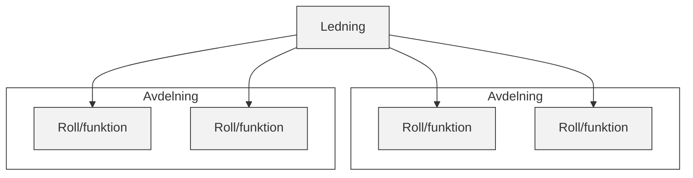
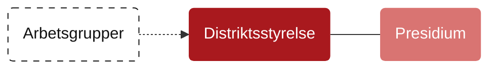

# Organisationsschema

Organisationsschemat ska visa hur distriktets delar hänger ihop på en bild.

Det ska inte förklara hela styrmodellen en gång till. Den övergripande logiken finns i [styrarkitekturen](styrarkitektur.md), rollerna beskrivs i [ansvar och roller](ansvar-och-roller.md) och konkret ansvarsfördelning hör hemma i [ansvarsmatrisen](../strategi-och-operativt-uppdrag/ansvarsmatris.md).


Schemat ska visa struktur, inte skapa mandat. Om bilden och ett beslutat dokument pekar åt olika håll gäller det beslutade dokumentet enligt [normordningen](../grund-och-varden/normordning.md).







## Bilden ska visa relationerna

Ett bra organisationsschema visar inte bara rutor. Det visar relationer.

För Smålands Fotbollförbund är fyra relationer särskilt viktiga: mandat, rapportering, samverkan och granskning. De bör visas med olika linjer eller annan tydlig markering, så att läsaren ser skillnad på vem som ger uppdrag, vem som rapporterar, vem som samverkar och vem som granskar.

<table data-view="cards"><thead><tr><th></th></tr></thead><tbody><tr><td><strong>Mandat</strong><br>Vem som ger uppdrag eller beslutanderätt.</td></tr><tr><td><strong>Rapportering</strong><br>Vem som återrapporterar till vem.</td></tr><tr><td><strong>Samverkan</strong><br>Vilka som behöver arbeta tillsammans utan att vara över- eller underordnade.</td></tr><tr><td><strong>Granskning</strong><br>Vilka funktioner som ska kunna pröva, granska eller bereda självständigt.</td></tr></tbody></table>

## Grundstrukturen i bilden

Bilden bör vara enkel nog att förstå snabbt. Den behöver samtidigt vara korrekt nog för att inte skapa fel förväntningar.



**Det ska synas**

Medlemsföreningarnas demokratiska mandat.

Årsmötet som högsta beslutande organ.

Representantskapet som medlemsorgan för tävlingsfrågor.

Distriktsstyrelsen som strategisk ledning mellan de demokratiska mötena.

Distriktschef och kansli som operativ ledning och genomförande.



**Det ska hållas isär**

Granskande funktioner rapporterar till årsmötet.

Arbetsgrupper rapporterar till distriktsstyrelsen om inte annat beslutats.

Referensgrupper rapporterar till kansliet om inte annat beslutats.

Kommittéer är inte egna styrelser.

Presidiet är inte ett parallellt beslutsorgan.



## En skiss för hur det kan ritas

```
Medlemsföreningar
        │
        ▼
Årsmöte
   │        ▲
   │        │ rapportering / granskning
   │        │
   │   Valberedning
   │   Revision
   │   Lekmannarevision
   │   Disciplinnämnd
   │
   ├── Representantskap
   │
   ▼
Distriktsstyrelse ── Presidium
        │
        ├── Kommittéer
        │
        ├── Arbetsgrupper
        │       └── rapporterar till distriktsstyrelsen
        │
        ▼
Distriktschef
        │
        ▼
Kansli
        │
        └── Referensgrupper
                └── rapporterar till kansliet
```

Skissen är inte färdig formgivning. Den visar huvudlogiken: medlemsföreningarna bär mandatet, årsmötet är den högsta demokratiska nivån, distriktsstyrelsen leder mellan de demokratiska mötena, kansliet genomför i vardagen och granskande funktioner står vid sidan av den operativa linjen.

## Rita inte in mer än bilden klarar

Organisationsschemat ska inte bära all information. Om varje projekt, roll, kontaktperson och arbetsflöde ritas in blir bilden svår att använda.


Om schemat kräver långa förklaringar har det blivit för detaljerat. Flytta då detaljer till arbetsordningar, instruktioner, processer, bilagor eller andra dokument i [dokumentarkivet](https://app.gitbook.com/o/TR51rgBV2VcNfsavrrCR/s/ENOAH9wAe9WidINWNBqc/).


Ett bra schema ska hjälpa läsaren att hitta rätt nästa steg. Inte svara på varje fråga själv.
